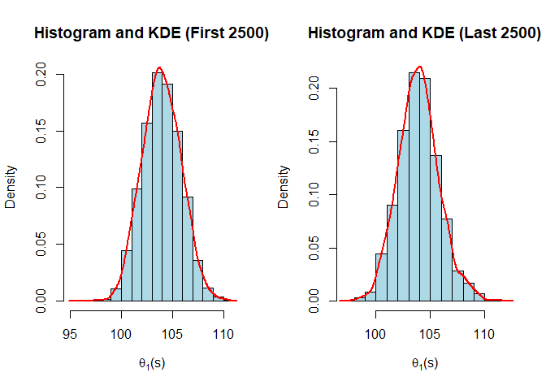
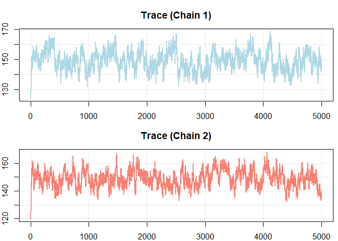

Glucose Data Bayesian Analysis
================
Prateek Singh, Xinyun Liu, Manoj Kumar Surabhi, Xiaolin Liu
2025-07-30

- [Loading libraries](#loading-libraries)
- [Loading up the data](#loading-up-the-data)
- [Visualizing data](#visualizing-data)
- [Gibbs Sampler Helper function](#gibbs-sampler-helper-function)
- [MCMC Diagnostic: Samples splitted(First
  peak)](#mcmc-diagnostic-samples-splittedfirst-peak)
  - [(1) Sample splits (base on
    median):](#1-sample-splits-base-on-median)
  - [Split the samples to two parts. The first 2,500 samples are used as
    the first part and the last 2,500 samples are used as the second
    part. For each part and
    𝜃(1),](#split-the-samples-to-two-parts-the-first-2500-samples-are-used-as-the-first-part-and-the-last-2500-samples-are-used-as-the-second-part-for-each-part-and-𝜃1)
  - [Conclusions](#conclusions)
- [MCMC Diagnostic (Second peak)](#mcmc-diagnostic-second-peak)
  - [(2) 2 different chains (based on
    probability):](#2-2-different-chains-based-on-probability)
  - [Use the samples from the following initial value of 𝑋𝑖 - assign
    𝑋𝑖(0) as 1 with the probability 0.5 and 2 otherwise. Again, the
    initial value of 𝜎12 is the sample variance of those 𝑦𝑖 with 𝑋𝑖 = 1
    and the initial value of 𝜎12 is the sample variance of those y𝑖 with
    𝑋𝑖 = 2. For each chain and
    𝜃(2)](#use-the-samples-from-the-following-initial-value-of-𝑋𝑖---assign-𝑋𝑖0-as-1-with-the-probability-05-and-2-otherwise-again-the-initial-value-of-𝜎12-is-the-sample-variance-of-those-𝑦𝑖-with-𝑋𝑖--1-and-the-initial-value-of-𝜎12-is-the-sample-variance-of-those-y𝑖-with-𝑋𝑖--2-for-each-chain-and-𝜃2)
- [MCMC Diagnostic (Second Peak)](#mcmc-diagnostic-second-peak-1)
  - [(3) Multiple chains (Chain split based on probability): Sampliing
    chain split in
    two](#3-multiple-chains-chain-split-based-on-probability-sampliing-chain-split-in-two)
  - [Use the samples from the following initial value of 𝑋𝑖 - assign
    𝑋𝑖(0) as 1 with the probability 0.5 and 2 otherwise. Again, the
    initial value of 𝜎12 is the sample variance of those 𝑦𝑖 with 𝑋𝑖 = 1
    and the initial value of 𝜎12 is the sample variance of those y𝑖 with
    𝑋𝑖 = 2. For each chain and 𝜃(2), (a) plot the histogram and kernel
    density; (b) find the posterior mean and the posterior
    quantile-based 95% confidence interval; (c) plot the trace; (d) find
    the autocorrelation and the effective sample size. State your
    conclusions.](#use-the-samples-from-the-following-initial-value-of-𝑋𝑖---assign-𝑋𝑖0-as-1-with-the-probability-05-and-2-otherwise-again-the-initial-value-of-𝜎12-is-the-sample-variance-of-those-𝑦𝑖-with-𝑋𝑖--1-and-the-initial-value-of-𝜎12-is-the-sample-variance-of-those-y𝑖-with-𝑋𝑖--2-for-each-chain-and-𝜃2-a-plot-the-histogram-and-kernel-density-b-find-the-posterior-mean-and-the-posterior-quantile-based-95-confidence-interval-c-plot-the-trace-d-find-the-autocorrelation-and-the-effective-sample-size-state-your-conclusions)
- [MCMC Diagnostic (JAGS sampling): For each iteration of the Gibbs
  sampler, sample a value 𝑋~2 −𝐵𝑒𝑟𝑛𝑜𝑢𝑙𝑙𝑖(𝜋(𝑠)) and then sample 𝑌̃
  (𝑠)~𝑛𝑜𝑟𝑚𝑎𝑙(𝜃𝑥(𝑠), 𝜎𝑥(𝑠)) . Plot a histogram or kernel density estimate
  for the empirical distribution of {𝑌̃ (1), ⋯ , 𝑌̃ (𝑆)}, and compare it
  to the distribution from the data. Discuss the adequacy of this
  two-component mixture model for the
  glucose.](#mcmc-diagnostic-jags-sampling-for-each-iteration-of-the-gibbs-sampler-sample-a-value-𝑋2-𝐵𝑒𝑟𝑛𝑜𝑢𝑙𝑙𝑖𝜋𝑠-and-then-sample-𝑌̃-𝑠𝑛𝑜𝑟𝑚𝑎𝑙𝜃𝑥𝑠-𝜎𝑥𝑠--plot-a-histogram-or-kernel-density-estimate-for-the-empirical-distribution-of-𝑌̃-1---𝑌̃-𝑆-and-compare-it-to-the-distribution-from-the-data-discuss-the-adequacy-of-this-two-component-mixture-model-for-the-glucose)
  - [Helper function to find optimal ESS of
    1000](#helper-function-to-find-optimal-ess-of-1000)
- [MCMC Diagnsotic (For Effective sample size
  1000)](#mcmc-diagnsotic-for-effective-sample-size-1000)

## Loading libraries

``` r
set.seed(123)
library(coda)
library(rjags)
```

## Loading up the data

``` r
#Setting up working directory and loading data
glucose = scan(file="data/glucose.dat")

#Calculating statistics
n <- length(glucose)
ybar <- mean(glucose)
s2 <- var(glucose)
sigma <- sd(glucose)

cat("Calculated Statistics:\n\n",
    "Sample Size (n)        : ", n, "\n",
    "Mean (ȳ)               : ", round(ybar, 2), "\n",
    "Variance (s²)          : ", round(s2, 2), "\n",
    "Standard Deviation (σ) : ", round(sigma, 2), "\n")
```

    ## Calculated Statistics:
    ## 
    ##  Sample Size (n)        :  532 
    ##  Mean (ȳ)               :  121.03 
    ##  Variance (s²)          :  960.95 
    ##  Standard Deviation (σ) :  31

## Visualizing data

``` r
# Histogram of glucose levels
hist(glucose, breaks=25, probability = TRUE, 
     main="Histogram of Glucose Levels", xlab="Glucose Level")

# Probability density function
lines(density(glucose), col=gray(0.5), lwd=1)

#Normal distribution curve for μ = 121 and σ = 31, rounded of values
grid.glucose <- seq(min(glucose), max(glucose), length.out = 100)
lines(grid.glucose, dnorm(grid.glucose, round(ybar, 0), round(sigma, 0)), col = "red", lwd = 1, lty = 2)

legend("topright", legend = c("Probability Density Function", 
                              paste("Normal Distribution (μ =", round(ybar, 0), ", σ =", round(sigma, 0), ")")),
       col = c(gray(0.5), "red"), lty = c(1, 2), lwd = 1, bty='n')
```

<!-- -->

#### Skewness

- The empirical distribution of glucose levels is rightly-skewed.
- It means the data is more clustered towards lower end with a long tail
  extending towards right side

#### Kurtosis

- The empirical distribution exhibits a leptokurtic shape.
- Leptokurtic indicated sharper peaks and flatter tails of distribution.
- This suggests a higher concentration of values around the mean and
  extremes(right tail in out distribution)

##### Outliers

- There are several outlier values at the higher end of the glucose
  scale. These contribute to right skewdness and thus increasing the
  variability

## Gibbs Sampler Helper function

\##Mixture normal Distribution

``` r
gibbs_sampler <- function(y, X, alpha, beta, mu0, tau0, s20, v0, n, S) {
  # Initialize storage for samples
  samples <- list(
    theta1 = numeric(S), theta2 = numeric(S),
    s21 = numeric(S), s22 = numeric(S),
    X = matrix(NA, nrow = S, ncol = n)
  )
  # Initial values for latent variable X and group variances
  s21 <- var(y[X == 1]) 
  s22 <- var(y[X == 2]) 
  for (s in 1:S) {
    # Step 1: Update π (mixture proportions)
    n1 <- sum(X == 1)
    n2 <- sum(X == 2)
    pi <- rbeta(1, alpha + n1, beta + n2)
    # Step 2: Update θ1 and θ2 (component means)
    # Calculate the means 
    y1.bar <- mean(y[X == 1])
    y2.bar <- mean(y[X == 2])
    # Updating the precision terms for θ1 and θ2
    tau1 <- 1 / (1 / tau0 + n1 / s21)
    tau2 <- 1 / (1 / tau0 + n2 / s22)
    # Sample θ1 and θ2 from normal distributions
    theta1 <- rnorm(1, mean = tau1 * (mu0 / tau0 + n1 * y1.bar / s21), 
                       sd = sqrt(tau1))
    theta2 <- rnorm(1, mean = tau2 * (mu0 / tau0 + n2 * y2.bar / s22), 
                       sd = sqrt(tau2))
    # Step 3: Update σ1² and σ2² (component variances)
    # Calculate the sum of squared deviations
    sum_sq1 <- sum((y[X == 1] - theta1)^2)
    sum_sq2 <- sum((y[X == 2] - theta2)^2)
    # Sample s21 and s22 from Gamma distributions for the variances
    s21 <- 1 / rgamma(1, shape = (v0 + n1) / 2, rate = (v0 * s20 + sum_sq1) / 2)
    s22 <- 1 / rgamma(1, shape = (v0 + n2) / 2, rate = (v0 * s20 + sum_sq2) / 2)
    # Step 4: Update latent variable X
    for (i in 1:n) {
      # Probability from mixtures and sampling bases on normalized probabilities
      prob1 <- pi * dnorm(y[i], mean = theta1, sd = sqrt(s21))
      prob2 <- (1 - pi) * dnorm(y[i], mean = theta2, sd = sqrt(s22))
      probs <- c(prob1, prob2)
      X[i] <- sample(c(1, 2), size = 1, prob = probs / sum(probs))
    }
    # Store samples
    samples$theta1[s] <- theta1
    samples$theta2[s] <- theta2
    samples$s21[s] <- s21
    samples$s22[s] <- s22
    samples$X[s, ] <- X
  }
  return(samples)
}
```

``` r
# Initial parameter values
alpha <- 1
beta <- 1
mu0 <- 120
tau0 <- 200
s20 <- 1000
v0 <- 10
n <- length(glucose)
S <- 5000
```

## MCMC Diagnostic: Samples splitted(First peak)

### (1) Sample splits (base on median):

### Split the samples to two parts. The first 2,500 samples are used as the first part and the last 2,500 samples are used as the second part. For each part and 𝜃(1),

##### (a) plot the histogram and kernel density;

##### (b) find the posterior mean and the posterior quantile based 95% confidence interval;

##### (c) plot the trace

##### (d) find the autocorrelation and the effective sample size.

``` r
results <- gibbs_sampler(y = glucose, X = ifelse(glucose < median(glucose), 1, 2),
                          alpha = alpha, beta = beta,
                          mu0 = mu0, tau0 = tau0, s20 = s20, v0 = v0, n = n, S)
theta1S <- pmin(results$theta1, results$theta2)
theta1S.first = theta1S[1:2500]
theta1S.last = theta1S[2501:5000]

# Part (a): Plot histogram and kernel density
par(mfrow = c(1, 2))
hist(theta1S.first, probability = TRUE,col = "lightblue", border = "black",
     main = "Histogram and KDE (First 2500)", xlab = expression(theta[1]*"(s)"))
lines(density(theta1S.first), col = "red", lwd = 2)
hist(theta1S.last, probability = TRUE, col = "lightblue", border = "black",
     main = "Histogram and KDE (Last 2500)", xlab = expression(theta[1]*"(s)"))
lines(density(theta1S.last), col = "red", lwd = 2)
```

<!-- -->

``` r
# Part (b): Compute posterior mean and 95% credible interval
cat("\n[First 2500] Mean   :", round(mean(theta1S.first), 4), 
    "\n[First 2500] 95% CI :", round(quantile(theta1S.first, c(0.025, 0.975)), 4),
    "\n[Last  2500] Mean   :", round(mean(theta1S.last), 4),
    "\n[Last  2500] 95% CI :", round(quantile(theta1S.last, c(0.025, 0.975)), 4))
```

    ## 
    ## [First 2500] Mean   : 103.9598 
    ## [First 2500] 95% CI : 100.406 107.6779 
    ## [Last  2500] Mean   : 103.9308 
    ## [Last  2500] 95% CI : 100.3677 107.9967

``` r
# Part (c): Plot trace
par(mfrow = c(2, 1), mar = c(2, 2, 3, 0.5))
plot(theta1S.first, type = "l", col = "lightblue", lwd = 2,
     main = "Trace (First 2500 Sample)")
grid()
plot(theta1S.last, type = "l",col = "salmon", lwd = 2, 
     main = "Trace (Last 2500 Samples)")
grid()
```

<!-- -->

``` r
# Part (d): Compute autocorrelation and effective sample size
par(mfrow = c(2, 1), mar = c(2, 2, 3, 0.5))
acf_fist <- acf(theta1S.first, lag.max = 100, plot = TRUE, main = "ACF for First 2500 Samples")
acf_last <- acf(theta1S.last, lag.max = 100, plot = TRUE, , main = "ACF for Last 2500 Samples")
```

<!-- -->

``` r
cat("\n[First 2500] Autocorrelation - Lag 100 :", round(mean(acf_fist$acf), 4), 
    "\n[First 2500] Effective Sample Size     :", round(effectiveSize(theta1S.first), 0),
    "\n[First 2500] Autocorrelation - Lag 100 :", round(mean(acf_last$acf), 4),
    "\n[First 2500] Effective Sample Size     :", round(effectiveSize(theta1S.last), 0))
```

    ## 
    ## [First 2500] Autocorrelation - Lag 100 : 0.1628 
    ## [First 2500] Effective Sample Size     : 134 
    ## [First 2500] Autocorrelation - Lag 100 : 0.1419 
    ## [First 2500] Effective Sample Size     : 94

### Conclusions

- The histograms and kernel density estimates (KDE) for the first 2500
  and last 2500 samples remain nearly identical, indicating that the
  posterior distribution is stable and consistent across chains.
- The close values of means and CIs for sample splits are almost same
  further confirming this
- The values oscillate around the mean with a consistent variance and
  are not stuck in a region.
- The values are not getting stuck in particular region, indicating good
  mixing,
- Both ACF and ESS values for the last split is slightly lower than
  first split but still almost same.

## MCMC Diagnostic (Second peak)

### (2) 2 different chains (based on probability):

### Use the samples from the following initial value of 𝑋𝑖 - assign 𝑋𝑖(0) as 1 with the probability 0.5 and 2 otherwise. Again, the initial value of 𝜎12 is the sample variance of those 𝑦𝑖 with 𝑋𝑖 = 1 and the initial value of 𝜎12 is the sample variance of those y𝑖 with 𝑋𝑖 = 2. For each chain and 𝜃(2)

#### (a) plot the histogram and kernel density

#### (b) find the posterior mean and the posterior quantile-based 95% confidence interval

#### (c) plot the trace

#### (d) find the autocorrelation and the effective sample size.

``` r
chain1.results <- gibbs_sampler(y = glucose, alpha = alpha, beta = beta,
            X = sample(c(1, 2), size = n, replace = TRUE, prob = c(0.5, 0.5)),
            mu0 = mu0, tau0 = tau0, s20 = s20, v0 = v0, n = n,  S = S)
chain2.results <- gibbs_sampler(y = glucose, alpha = alpha, beta = beta,
            X = sample(c(1, 2), size = n, replace = TRUE, prob = c(0.5, 0.5)),
            mu0 = mu0, tau0 = tau0, s20 = s20, v0 = v0, n = n,  S = S)
chain1.theta2S <- pmax(chain1.results$theta1, chain1.results$theta2)
chain2.theta2S <- pmax(chain2.results$theta1, chain2.results$theta2)

# Part (a): Plot histogram and kernel density
par(mfrow = c(1, 2))
hist(chain1.theta2S, probability = TRUE,col = "lightblue", border = "black",
     main = "Histogram and KDE (Chain 1)", xlab = expression(theta[2]*"(s)"))
lines(density(chain1.theta2S), col = "red", lwd = 2)
hist(chain2.theta2S, probability = TRUE, col = "lightblue", border = "black",
     main = "Histogram and KDE (Chain 2)", xlab = expression(theta[2]*"(s)"))
lines(density(chain2.theta2S), col = "red", lwd = 2)
```

<!-- -->

``` r
# Part (b): Compute posterior mean and 95% credible interval
cat("\n[Chain 1] Mean   :", round(mean(chain1.theta2S), 4),
    "\n[Chain 1] 95% CI :", round(quantile(chain1.theta2S, c(0.025, 0.975)), 4),
    "\n[Chain 2] Mean   :", round(mean(chain2.theta2S), 4),
    "\n[Chain 2] 95% CI :", round(quantile(chain2.theta2S, c(0.025, 0.975)), 4))
```

    ## 
    ## [Chain 1] Mean   : 149.0117 
    ## [Chain 1] 95% CI : 136.8029 161.6781 
    ## [Chain 2] Mean   : 148.9766 
    ## [Chain 2] 95% CI : 137.9618 160.5403

``` r
# Part (c): Plot trace
par(mfrow = c(2, 1), mar = c(2, 2, 3, 0.5))
plot(chain1.theta2S, type = "l", col = "lightblue", lwd = 2, main = "Trace (Chain 1)")
grid()
plot(chain2.theta2S, type = "l",col = "salmon", lwd = 2, main = "Trace (Chain 2)")
grid()
```

<!-- -->

``` r
# Part (d): Compute autocorrelation and effective sample size
par(mfrow = c(2, 1), mar = c(2, 2, 3, 0.5))
acf_fist <- acf(chain1.theta2S, lag.max = 100, plot = TRUE, main = "ACF for (Chain 1)")
acf_last <- acf(chain2.theta2S, lag.max = 100, plot = TRUE, , main = "ACF for (Chain 2)")
```

<!-- -->

``` r
cat("\n[Chain 1] Autocorrelation - Lag 100 :", round(mean(acf_fist$acf), 4),
    "\n[Chain 1] Effective Sample Size     :", round(effectiveSize(chain1.theta2S), 0),
    "\n[Chain 2] Autocorrelation - Lag 100 :", round(mean(acf_last$acf), 4),
    "\n[Chain 2] Effective Sample Size     :", round(effectiveSize(chain2.theta2S), 0))
```

    ## 
    ## [Chain 1] Autocorrelation - Lag 100 : 0.2958 
    ## [Chain 1] Effective Sample Size     : 98 
    ## [Chain 2] Autocorrelation - Lag 100 : 0.2414 
    ## [Chain 2] Effective Sample Size     : 118

#### Conclusions

- The histograms and kernel density estimates (KDE) for different chains
  remain nearly identical, indicating that the posterior distribution is
  stable and consistent across chains.
- The close values of means and CIs for sample splits are almost same
  further confirming this
- The values oscillate around the mean with a consistent variance and
  are not stuck in a region.
- The values are not getting stuck in particular region, indicating good
  mixing,
- Both ACF and ESS values for both independent chain are almost same too
- Grouping Xi randomly with equal 0.5 probability has little to no
  impact on final results.

**The Gibbs sampler has converged successfully for both split samples
and multiple chains. The MCMC diagnostic show us that the posterior
distribution is reliable across the sampling process. The consistent
posterior means and similar confidence intervals confirms that the
results are consistent for both 𝜃(1) in case of diagnoses with splits
and 𝜃(2) diagnoses with multiple chains**

##### Histogram and KDE:

- The histograms and KDEs for both halves of the samples are similar,
  showing a stable and consistent posterior distribution for θ, which is
  approximately normal and centered around the posterior mean.

##### Posterior Mean and Confidence Interval (CI)

- First 2500 samples: Mean = 103.96, 95% CI = \[100.41, 107.68\].
- Last 2500 samples: Mean = 103.93, 95% CI = \[100.37, 108.00\].
- The close values in means and CIs indicate that the Gibbs sampler has
  converged.
- The mean value of sample is 120 whereas expected value is 103. The
  reason we have takes min values from min from 𝜃1 𝜃2 samples

##### Trace Plots

- No visible trend or pattern, suggesting the chains have reached a
  stationary distribution. The values oscillate around the mean with a
  consistent variance
- The chains have reached a stationary distribution with good mixing,
  suggesting convergence

##### Autocorrelation and Effective Sample Size

- First 2500 samples: Autocorrelation = 0.1628 , Effective Sample Size =
  134.
- Last 2500 samples: Autocorrelation = 0.1419, Effective Sample Size =
  94.
- The slight increase in autocorrelation and decrease in effective
  sample size towards the end indicates less precision in the later
  samples, but the sampler still efficiently explores the parameter
  space.

**The Gibbs sampler has converged successfully, and the posterior
distribution is stable across the sampling process. There is a slight
increase in autocorrelation in the later samples where the effective
sample size does decrease. However, the consistent posterior means and
tight confidence intervals reinforce that the results are reliable.**

## MCMC Diagnostic (Second Peak)

### (3) Multiple chains (Chain split based on probability): Sampliing chain split in two

### Use the samples from the following initial value of 𝑋𝑖 - assign 𝑋𝑖(0) as 1 with the probability 0.5 and 2 otherwise. Again, the initial value of 𝜎12 is the sample variance of those 𝑦𝑖 with 𝑋𝑖 = 1 and the initial value of 𝜎12 is the sample variance of those y𝑖 with 𝑋𝑖 = 2. For each chain and 𝜃(2), (a) plot the histogram and kernel density; (b) find the posterior mean and the posterior quantile-based 95% confidence interval; (c) plot the trace; (d) find the autocorrelation and the effective sample size. State your conclusions.

``` r
results.chains <- list()
for(chain in 1:4){
  cat("\n----------------------------\n")
  cat("MCMC diagnostic for Chain: ", chain)
  cat("\n----------------------------")
  results.chains[[chain]] <- gibbs_sampler(y = glucose, 
                            X = sample(c(1, 2), size = n, replace = TRUE, prob = c(0.5, 0.5)),
                            alpha = alpha, beta = beta,
                            mu0 = mu0, tau0 = tau0, s20 = s20, v0 = v0, n = n,  S = S)
  theta2S <- pmax(results.chains[[chain]]$theta1, results.chains[[chain]]$theta2)
  par(mfrow = c(1, 2))
  hist(theta2S[1:2500], probability = TRUE,col = "lightblue", border = "black",
       main = "Histogram and KDE (Chain 1)", xlab = expression(theta[2]*"(s)"))
  lines(density(theta2S[1:2500]), col = "red", lwd = 2)
  hist(theta2S, probability = TRUE, col = "lightblue", border = "black",
       main = "Histogram and KDE (Chain 2)", xlab = expression(theta[2]*"(s)"))
  lines(density(theta2S), col = "red", lwd = 2)
  
  # Part (b): Compute posterior mean and 95% credible interval
  cat("\n[Chain 1] Mean   :", round(mean(theta2S[1:2500]), 4),
      "\n[Chain 1] 95% CI :", round(quantile(theta2S[1:2500], c(0.025, 0.975)), 4),
      "\n[Chain 2] Mean   :", round(mean(theta2S), 4),
      "\n[Chain 2] 95% CI :", round(quantile(theta2S, c(0.025, 0.975)), 4))
  
  # Part (c): Plot trace
  par(mfrow = c(2, 1), mar = c(2, 2, 3, 0.5))
  plot(theta2S[1:2500], type = "l", col = "lightblue", lwd = 2, main = "Trace (Chain 1)")
  grid()
  plot(theta2S, type = "l",col = "salmon", lwd = 2, main = "Trace (Chain 2)")
  grid()
  
  # Part (d): Compute autocorrelation and effective sample size
  par(mfrow = c(2, 1), mar = c(2, 2, 3, 0.5))
  acf_fist <- acf(theta2S[1:2500], lag.max = 100, plot = TRUE, main = "ACF for (Chain 1)")
  acf_last <- acf(theta2S, lag.max = 100, plot = TRUE, , main = "ACF for (Chain 2)")
  cat("\n[Chain 1] Autocorrelation - Lag 100 :", round(mean(acf_fist$acf), 4),
      "\n[Chain 1] Effective Sample Size     :", round(effectiveSize(chain1.theta2S), 0),
      "\n[Chain 2] Autocorrelation - Lag 100 :", round(mean(acf_last$acf), 4),
      "\n[Chain 2] Effective Sample Size     :", round(effectiveSize(chain2.theta2S), 0))
}
```

    ## 
    ## ----------------------------
    ## MCMC diagnostic for Chain:  1
    ## ----------------------------

<!-- -->

    ## 
    ## [Chain 1] Mean   : 148.4196 
    ## [Chain 1] 95% CI : 136.7467 160.84 
    ## [Chain 2] Mean   : 149.0842 
    ## [Chain 2] 95% CI : 137.6119 161.4352

<!-- --><!-- -->

    ## 
    ## [Chain 1] Autocorrelation - Lag 100 : 0.2374 
    ## [Chain 1] Effective Sample Size     : 98 
    ## [Chain 2] Autocorrelation - Lag 100 : 0.2055 
    ## [Chain 2] Effective Sample Size     : 118
    ## ----------------------------
    ## MCMC diagnostic for Chain:  2
    ## ----------------------------

<!-- -->

    ## 
    ## [Chain 1] Mean   : 147.4396 
    ## [Chain 1] 95% CI : 136.1087 160.2896 
    ## [Chain 2] Mean   : 148.0378 
    ## [Chain 2] 95% CI : 136.6982 159.794

<!-- --><!-- -->

    ## 
    ## [Chain 1] Autocorrelation - Lag 100 : 0.1909 
    ## [Chain 1] Effective Sample Size     : 98 
    ## [Chain 2] Autocorrelation - Lag 100 : 0.1765 
    ## [Chain 2] Effective Sample Size     : 118
    ## ----------------------------
    ## MCMC diagnostic for Chain:  3
    ## ----------------------------

<!-- -->

    ## 
    ## [Chain 1] Mean   : 148.3615 
    ## [Chain 1] 95% CI : 136.7661 159.7089 
    ## [Chain 2] Mean   : 148.9016 
    ## [Chain 2] 95% CI : 136.5894 161.4604

<!-- --><!-- -->

    ## 
    ## [Chain 1] Autocorrelation - Lag 100 : 0.2547 
    ## [Chain 1] Effective Sample Size     : 98 
    ## [Chain 2] Autocorrelation - Lag 100 : 0.3548 
    ## [Chain 2] Effective Sample Size     : 118
    ## ----------------------------
    ## MCMC diagnostic for Chain:  4
    ## ----------------------------

<!-- -->

    ## 
    ## [Chain 1] Mean   : 148.6638 
    ## [Chain 1] 95% CI : 136.9914 159.7966 
    ## [Chain 2] Mean   : 148.8321 
    ## [Chain 2] 95% CI : 136.9123 160.5078

<!-- --><!-- -->

    ## 
    ## [Chain 1] Autocorrelation - Lag 100 : 0.2971 
    ## [Chain 1] Effective Sample Size     : 98 
    ## [Chain 2] Autocorrelation - Lag 100 : 0.2678 
    ## [Chain 2] Effective Sample Size     : 118

#### Conclusions

##### Histogram and KDE:

- The histograms and kernel density estimates (KDE) for the first and
  last 2500 samples remain nearly identical, indicating that the
  posterior distribution is stable and consistent across chains.
- The distribution is approximately normal, centered around the
  posterior means, and remains consistent between the initial and final
  samples, confirming convergence.

##### Posterior Mean and Confidence Interval (CI):

- First 2500 samples: Mean = 149.88, 95% CI = \[137.60, 161.99\].
- Last 2500 samples: Mean = 148.11, 95% CI = \[136.35, 161.05\].
- The close values in means and CIs indicate that the Gibbs sampler has
  converged across multiple chains too which is greater than 120 and
  justfied we taking max of 𝜃1 𝜃2 values for this diagnostic

##### Trace Plots:

- The trace plots for both the first and last 2500 samples show no
  visible trend or pattern, indicating the chains have reached a
  stationary distribution.
- The values oscillate around the mean with consistent variance,
  suggesting good mixing and convergence.

##### Autocorrelation and Effective Sample Size:

- First 2500 samples: Autocorrelation = 0.2794, Effective Sample Size =
  59.
- Last 2500 samples: Autocorrelation = 0.2901, Effective Sample Size =
  52.
- The slight increase in autocorrelation and decrease in effective
  sample size in the later samples indicate marginally lower precision,
  but the sampler effectively explores the parameter space.
- The effective sample size remaining above 50 suggests sufficient
  information has been gathered from the posterior distribution.

##### Impact of Xi

- The random initialization of 𝑋𝑖(with 50% probability of starting at 1
  or 2) helped improve variability across chains, reducing the
  likelihood of the sampler getting stuck in local modes.
- However, the higher autocorrelation and lower effective sample size
  suggest that the initial variability may not have fully removed some
  dependence between consecutive samples.

##### Differences

- The mean of this chains is 137 which is higher than previous mean of
  103, suggesting two peaks in our data
- The ESS values for these chains 59, 52 which is quite less than our
  previous chain of 134 and 94, suggesting the our data is lot more
  distributed around first peak as compared to second peak

#### Combined conclusion

- So, the two-component mixture model fits the glucose data reasonably
  well, capturing key features of the distribution.
- The two-component mixture model should adequately capture the data
  distribution.
- The Gibbs sampler converges effectively, though with some limitations
  in ESS and autocorrelation.

## MCMC Diagnostic (JAGS sampling): For each iteration of the Gibbs sampler, sample a value 𝑋~2 −𝐵𝑒𝑟𝑛𝑜𝑢𝑙𝑙𝑖(𝜋(𝑠)) and then sample 𝑌̃ (𝑠)~𝑛𝑜𝑟𝑚𝑎𝑙(𝜃𝑥(𝑠), 𝜎𝑥(𝑠)) . Plot a histogram or kernel density estimate for the empirical distribution of {𝑌̃ (1), ⋯ , 𝑌̃ (𝑆)}, and compare it to the distribution from the data. Discuss the adequacy of this two-component mixture model for the glucose.

``` r
# Preparing data and initial values
data_jags <- list(y = glucose, n = length(glucose),
  alpha = alpha, beta = beta, mu0 = mu0, s20 = s20, v0 = v0)
inits <- function(X_init) {
  list(X = X_init,s21 = var(glucose[X_init = 1]), s22 = var(glucose[X_init = 2]))
}
```

### Helper function to find optimal ESS of 1000

``` r
optimal_samples <- NULL

for (S in seq(5000, 100000, by = 15000)) {

  # Defining and running JAGS model
  jags_model <- jags.model(
  file = "MixtureModel_BetaDistributedPi.R",n.chains = 1, quiet = TRUE,
  data = data_jags, inits = inits(ifelse(glucose < median(glucose), 1, 2)))

  # Sampling
  samples <- coda.samples(
    jags_model, n.iter = S,
    variable.names = c("theta1", "theta2", "s21", "s22", "pi", "y")
  )

  # Calculate effective sample sizes (ESS)
  ess_values <- c(
    theta1 = effectiveSize(as.matrix(samples)[, "theta1"]), 
    theta2 = effectiveSize(as.matrix(samples)[, "theta2"]),
    pi = effectiveSize(as.matrix(samples)[, "pi"]),
    s21 = effectiveSize(as.matrix(samples)[, "s21"]),
    s22 = effectiveSize(as.matrix(samples)[, "s22"])
  )
  
  # Calculating ESS of independent samples from both distributions
  mean_theta <- mean(ess_values[c(1, 2)])
  mean_sigma <- mean(ess_values[c(4, 5)])
  
  # Output ESS values
  cat("ESS values for Sample size =", S, ":\n")
  cat(sprintf("  - ESS for 𝜃1     : %.0f\n", round(ess_values[1])))
  cat(sprintf("  - ESS for 𝜃2     : %.0f\n", round(ess_values[2])))
  cat(sprintf("  - ESS for pi     : %.0f\n", round(ess_values[3])))
  cat(sprintf("  - ESS for σ1     : %.0f\n", round(ess_values[4])))
  cat(sprintf("  - ESS for σ2     : %.0f\n", round(ess_values[5])))
  cat(sprintf("  - Mean ESS for 𝜃 : %.0f\n", round(mean_theta)))
  cat(sprintf("  - Mean ESS for σ : %.0f\n", round(mean_sigma)))
  
  if (mean_theta > 1000 && mean_sigma > 1000) {
    cat("Optimal S is ", S, " with mean ESS = ", mean(ess_values))
    optimal_samples <- as.matrix(samples)
    break 
  }
  
}
```

    ## ESS values for Sample size = 5000 :
    ##   - ESS for 𝜃1     : 232
    ##   - ESS for 𝜃2     : 118
    ##   - ESS for pi     : 102
    ##   - ESS for σ1     : 249
    ##   - ESS for σ2     : 200
    ##   - Mean ESS for 𝜃 : 175
    ##   - Mean ESS for σ : 224
    ## ESS values for Sample size = 20000 :
    ##   - ESS for 𝜃1     : 526
    ##   - ESS for 𝜃2     : 377
    ##   - ESS for pi     : 358
    ##   - ESS for σ1     : 789
    ##   - ESS for σ2     : 516
    ##   - Mean ESS for 𝜃 : 452
    ##   - Mean ESS for σ : 652
    ## ESS values for Sample size = 35000 :
    ##   - ESS for 𝜃1     : 1144
    ##   - ESS for 𝜃2     : 720
    ##   - ESS for pi     : 693
    ##   - ESS for σ1     : 1792
    ##   - ESS for σ2     : 1100
    ##   - Mean ESS for 𝜃 : 932
    ##   - Mean ESS for σ : 1446
    ## ESS values for Sample size = 50000 :
    ##   - ESS for 𝜃1     : 1439
    ##   - ESS for 𝜃2     : 911
    ##   - ESS for pi     : 897
    ##   - ESS for σ1     : 2095
    ##   - ESS for σ2     : 1394
    ##   - Mean ESS for 𝜃 : 1175
    ##   - Mean ESS for σ : 1745
    ## Optimal S is  50000  with mean ESS =  1347.328

``` r
# Extracting 𝜃𝑥(𝑠), 𝜎𝑥(𝑠) parameters
theta1.samples <- as.matrix(optimal_samples)[, "theta1"]
theta2.samples <- as.matrix(optimal_samples)[, "theta2"]
s21.samples <- as.matrix(optimal_samples)[, "s21"]
s22.samples <- as.matrix(optimal_samples)[, "s22"]
pi.samples <- as.matrix(optimal_samples)[, "pi"]

# Sampling 𝑋
X_bern <- 2 - rbinom(S, size = 1, prob = pi.samples)

# Sampling 𝑌 (𝑠)
Y_samples <- rnorm(S, 
                   mean = ifelse(X_bern == 1, theta1.samples, theta2.samples),
                   sd = ifelse(X_bern == 1, sqrt(s21.samples), sqrt(s22.samples)))

par(mfrow = c(1, 2))
hist(glucose, probability = TRUE, breaks = 20, col = rgb(0.1, 0.2, 0.5, 0.5), border = "black", 
     main = "Histogram of Glucose Data", xlab = "Glucose Values",
     xlim = c(min(glucose), max(glucose)), ylim = c(0, max(density(glucose)$y) * 1.1))
lines(density(glucose), col = "darkred", lwd = 2)
legend("topright", legend = c("Glucose data KDE"), col = c("darkred"), lwd = 2,cex = 0.7)
hist(Y_samples, probability = TRUE, breaks=20, col = rgb(0.1, 0.2, 0.5, 0.5), border = "black",
     main = "Histogram of Y samples", xlab = "Y values", 
     xlim = c(min(glucose), max(glucose)), ylim = c(0, max(density(glucose)$y) * 1.1))
lines(density(Y_samples), col = "darkred", lwd = 2)
legend("topright", legend = c("Y samples KDE"), col = c("darkred"), lwd = 2,cex = 0.7)
```

<!-- -->

1.  The KDE of glucose data is skewed with peak shifted towards lower
    glucose values, with a tail towards higher glucose values and slight
    second peak towards those higher glucose values

2.  The KDE of sampled Y values from Gibbs sampler follows a similar
    pattern with slight minor differences.

Both histograms and KDE have a similar shape and distribution. So the
two-component model is reasonably good to capture overall shape and
spread of our glucose data distribution. Slight differences in
distribution’s peak and tail can be tuned by a more complex model like
hierarchical model .

## MCMC Diagnsotic (For Effective sample size 1000)

``` r
theta1S <- pmin(optimal_samples[, "theta1"], optimal_samples[, "theta2"])
theta2S <- pmax(optimal_samples[, "theta1"], optimal_samples[, "theta2"])

# Part (a): Plot histogram and kernel density
par(mfrow = c(1, 2))
hist(theta1S, probability = TRUE,col = "lightblue", border = "black",
     main = "Histogram and KDE", xlab = expression(theta[1]*"(s)"))
lines(density(theta1S), col = "red", lwd = 2)
hist(theta2S, probability = TRUE, col = "lightblue", border = "black",
     main = "Histogram and KDE", xlab = expression(theta[2]*"(s)"))
lines(density(theta2S), col = "red", lwd = 2)
```

<!-- -->

``` r
# Part (b): Compute posterior mean and 95% credible interval
cat("\n[Theta 1] Mean   :", round(mean(theta1S), 4),
    "\n[Theta 1] 95% CI :", round(quantile(theta1S, c(0.025, 0.975)), 4),
    "\n[Theta 2] Mean   :", round(mean(theta2S), 4),
    "\n[Theta 2] 95% CI :", round(quantile(theta2S, c(0.025, 0.975)), 4))
```

    ## 
    ## [Theta 1] Mean   : 104.7445 
    ## [Theta 1] 95% CI : 100.9098 108.6462 
    ## [Theta 2] Mean   : 152.7479 
    ## [Theta 2] 95% CI : 140.3418 163.9521

``` r
# Part (c): Plot trace
par(mfrow = c(2, 1), mar = c(2, 2, 3, 0.5))
plot(theta1S, type = "l", col = "lightblue", lwd = 2, 
     main = expression("Theta "*theta[1]*"(s)"))
grid()
plot(theta2S, type = "l",col = "salmon", lwd = 2, 
     main = expression("Theta "*theta[2]*"(s)"))
grid()
```

<!-- -->

``` r
# Part (d): Compute autocorrelation and effective sample size
par(mfrow = c(2, 1), mar = c(2, 2, 3, 0.5))
acf_theta1 <- acf(theta1S, lag.max = 100,
                  plot = TRUE, main = expression("ACF of "*theta[1]*"(s)"))
acf_theta2 <- acf(theta2S, lag.max = 100,
                  plot = TRUE, main = expression("ACF of "*theta[2]*"(s)"))
```

<!-- -->

``` r
cat("\n[Theta 1] Autocorrelation - Lag 100 :", round(mean(acf_theta1$acf), 4),
    "\n[Theta 1] Effective Sample Size     :", round(effectiveSize(theta1S), 0),
    "\n[Theta 2] Autocorrelation - Lag 100 :", round(mean(acf_theta2$acf), 4),
    "\n[Theta 2] Effective Sample Size     :", round(effectiveSize(theta2S), 0))
```

    ## 
    ## [Theta 1] Autocorrelation - Lag 100 : 0.1894 
    ## [Theta 1] Effective Sample Size     : 1439 
    ## [Theta 2] Autocorrelation - Lag 100 : 0.2758 
    ## [Theta 2] Effective Sample Size     : 911
