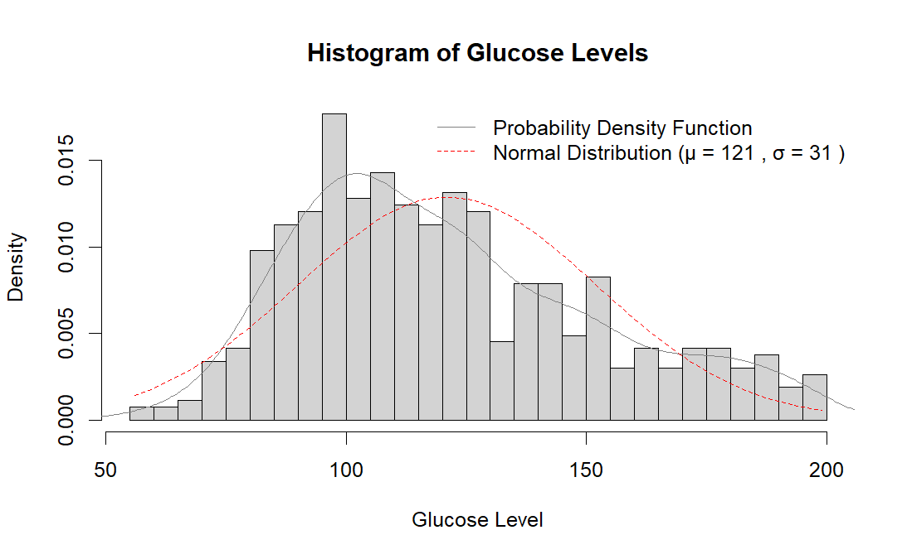
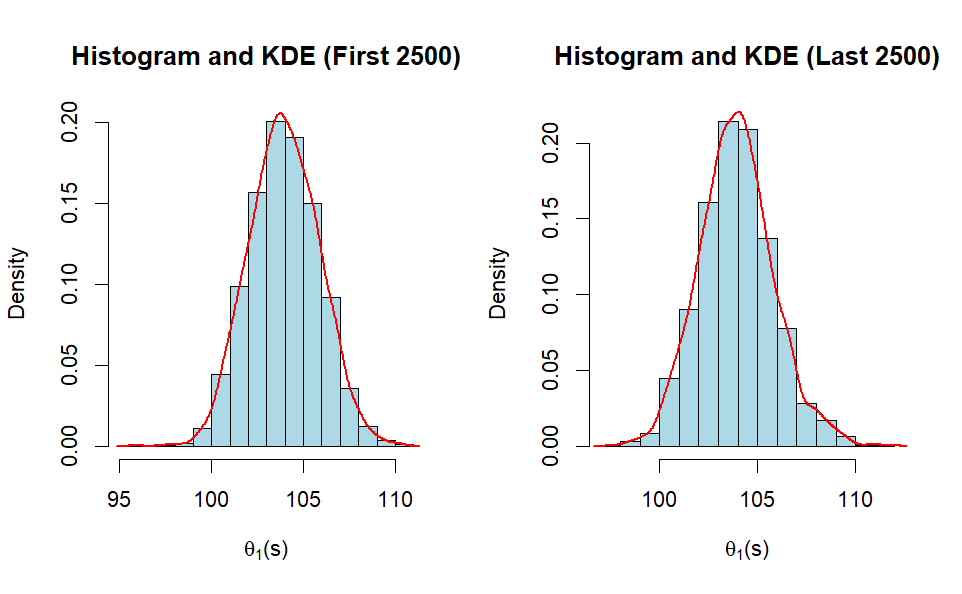
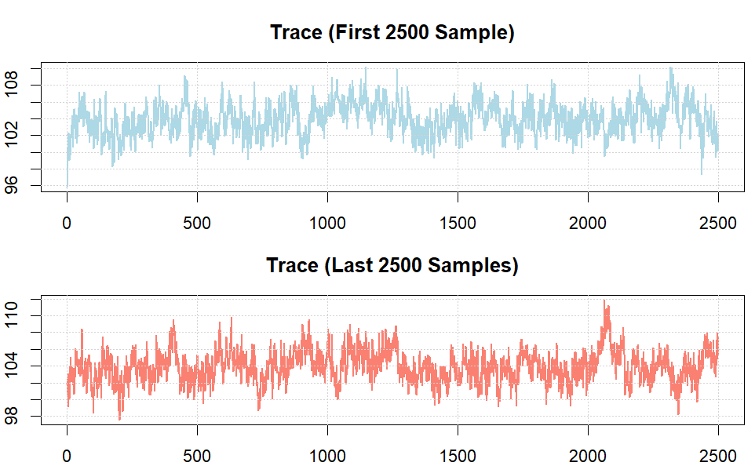
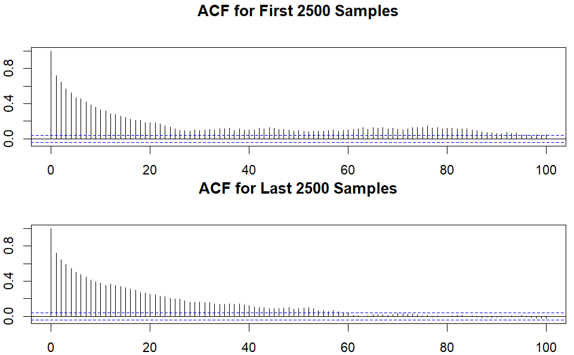
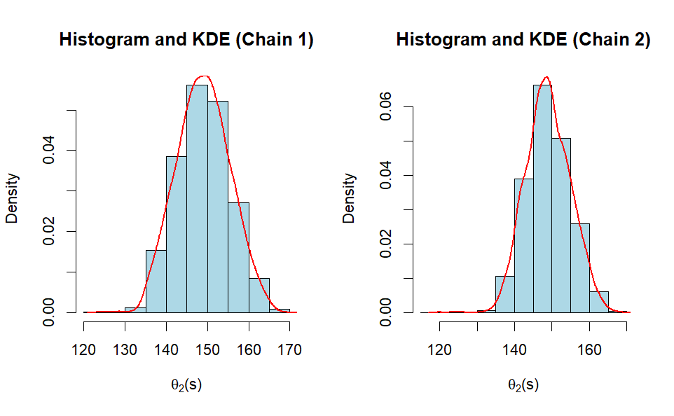
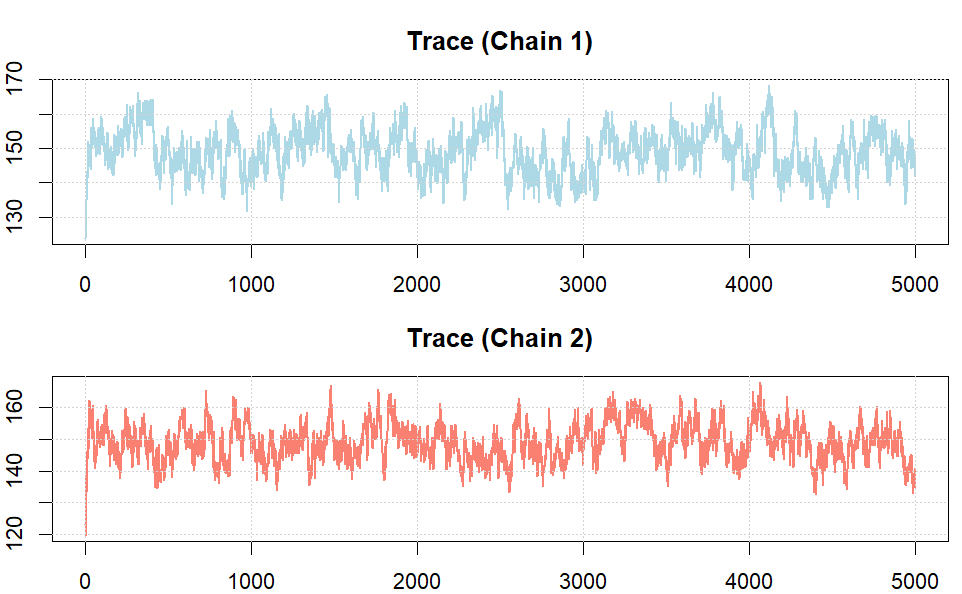
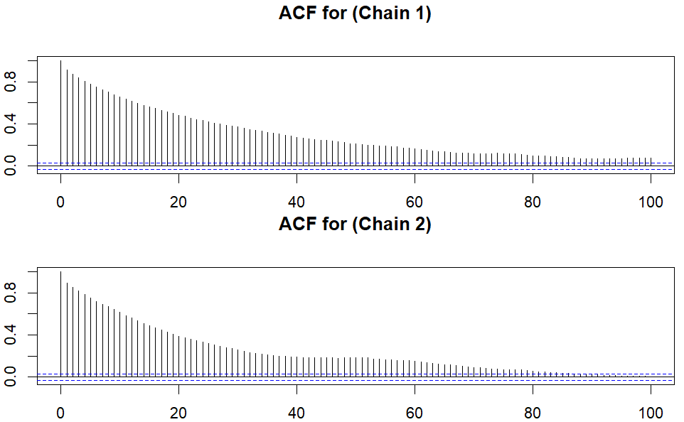
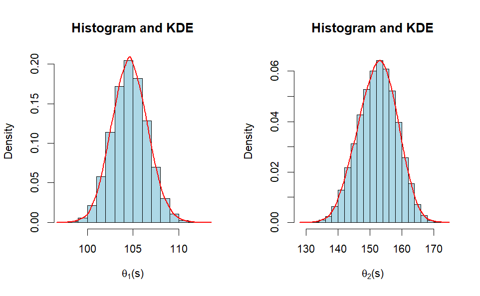
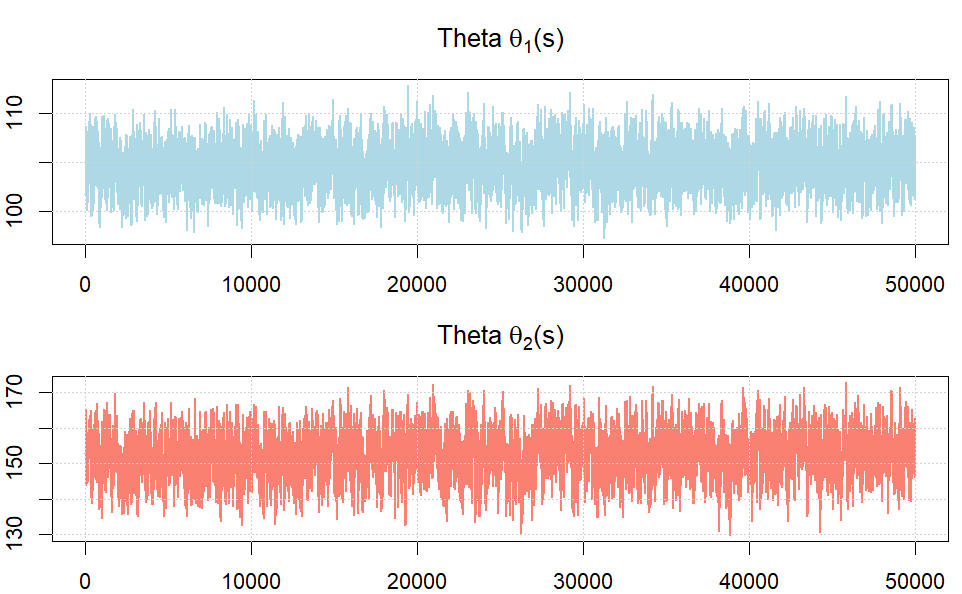
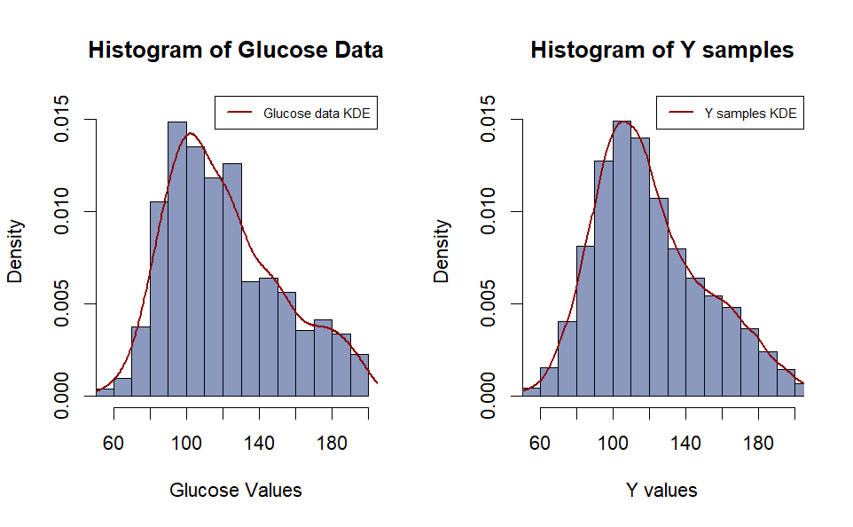

**Final Project for MA5770 - Bayesian Statistics**

**Name:** Prateek Singh, Xinyun Liu, Manoj Kumar Surabhi, Xiaolin Liu

**Project Title:** Bayesian Mixture Normal Model of Plasma Glucose Data

#  Section 1: Introduction

The study analyzes plasma glucose levels from 532 females living near
Phoenix, Arizona, who were tested for diabetes. The goal is to use a
Bayesian approach with a mixture of normal distributions, each with
different means and variances, to capture the data\'s skewness and
outliers, where a single normal distribution may not adequately
represent the data.

# Section 2: Statistical Analysis

The distribution of glucose levels is observed by the histogram and
kernel density function of the data. The measure of central tendencies
(mean, median and mode) and measure of dispersion (variance and standard
deviation) are calculated. A Bayesian mixture model approximates the
data distribution using a mixture of two normal models. The Gibbs and
JAGS samplers are used to obtain samples to approximate the posterior
distribution of the data. The analysis is performed using R Studio
software and the JAGS software package.

Figure 1 shows the histogram, kernel density estimation, and normal
distribution for the $mean(\mu)\ $ as 121.0 and $variance(\sigma)$ as
31.0 for the plasma glucose concentration of 532 females. It can be seen
that the data is rightly skewed. In addition, the sample mean, median,
mode, variance, and standard deviation are
$121.0,\ 115.0,\ 100.0,\ 961.0,\ and\ 31.0,$ respectively.

{width="6.5in" height="4.013888888888889in"}

**Figure 1** - Histogram and Kernel Density Estimation and
$normal(\mu = 121.0,\ \sigma = 31.0)$

# Section 3: Statistical Method

From Figure 1, we can see that a normal model should not be appropriate
to model the data. So, we use a Bayesian mixture model. Let
$y_{i}(i = 1,\ ...,532)$ denote the plasma glucose level from the *i*th
female. $y_{i}(i = 1,\ ...,532)$ is assumed to have the following
mixture normal distribution:

$p\left( y_{i}|\pi,\Theta_{1},\Theta_{2},\sigma_{1}^{2},\sigma_{2}^{2} \right) = \pi \ast dnorm\left( y_{i};\theta_{1},\sigma_{1}^{2} \right) + (1 - \pi) \ast dnorm\left( y_{i};\theta_{2},\sigma_{2}^{2} \right)\ $

Where $dnorm\left( y_{i};\theta_{1},\sigma_{1}^{2} \right)$ is the
probability density function at $y_{i}$ for the normal distribution with
mean $\theta_{1}$ and the variance $\sigma_{1}^{2}$ with probability as
$\pi$, and $dnorm\left( y_{i};\theta_{2},\sigma_{2}^{2} \right)$ is the
probability at $y_{i}$ for the normal distribution with mean
$\theta_{2}$ and the variance $\sigma_{2}^{2}$ with probability as
$(1 - \pi)$ and where
$\Theta_{1},\Theta_{2},\sigma_{1}^{2},\sigma_{2}^{2}$ are unknown
parameters.

We further assume that there is a latent variable x~i~ which can take
value $1$ with probability $\pi$ and $2$ with probability $(1 - \pi)$.
The value of x~i~ determines the distribution of $y_{i}$. Specifically,
the conditional distribution $y_{i}$ given $x_{i}$ and the parameters
is:

  ---------------------------------------------------------------------------------------------------------------------------------------------------------------------------------------------------------------------
  $p\left( y_{i}|x_{i},\pi,\Theta_{1},\Theta_{2},\sigma_{1}^{2},\sigma_{2}^{2} \right) = dnorm\left( y_{i};\theta_{x_{i}},\sigma_{x_{i}}^{2} \right)\  = \ ${   $dnorm\left( y_{i};\theta_{1},\sigma_{1}^{2} \right)$
                                                                                                                                                                $x_{i} = 1$
  ------------------------------------------------------------------------------------------------------------------------------------------------------------- -------------------------------------------------------
                                                                                                                                                                $dnorm\left( y_{i};\theta_{2},\sigma_{2}^{2} \right)$
                                                                                                                                                                $x_{i} = 2$

  ---------------------------------------------------------------------------------------------------------------------------------------------------------------------------------------------------------------------

Let $x_{i}(i = 1,\ ...,\ 532)$ denote the group membership which is
equal to $1$ and 2 with probability $\pi$ and $1 - \ \pi$. For
$x_{i} = 1$ and $x_{i} = 2$ the observation
$y_{i} \sim dnorm\left( y_{i};\theta_{x_{i}},\sigma_{x_{i}}^{2} \right)$
and $y_{i} \sim dnorm\left( y_{i};\theta_{2},\sigma_{2}^{2} \right)$
respectively. $x_{i}(i = 1,\ ...,\ 532)$ is unknown and considered as
missing data in the model. Therefore our Bayesian mixture normal model
can be described as followed

$p\left( y_{i}|x_{i},..,\ x_{532},\pi,\Theta_{1},\Theta_{2},\sigma_{1}^{2},\sigma_{2}^{2} \right) = dnorm\left( y_{i};\theta_{x_{i}},\sigma_{x_{i}}^{2} \right),i = 1,\ ...,\ 532\ $

For the sampling distribution, we assume
$y_{i}|x_{i},\pi,\Theta_{1},\Theta_{2},\sigma_{1}^{2},\sigma_{2}^{2}$
are conditionally independent

  --------------------------------------------------------------------------------------------------------------------------------------------------------------------------------------------
  $p\left( x_{i}|\pi,\Theta_{1},\Theta_{2},\sigma_{1}^{2},\sigma_{2}^{2} \right) = dnorm\left( y_{i};\theta_{x_{i}},\sigma_{x_{i}}^{2} \right) = \{$   $\pi$ $x_{i} = 1$ $i = 1,\ ...,\ 532$
  ---------------------------------------------------------------------------------------------------------------------------------------------------- ----------------- ---------------------
                                                                                                                                                       $1\  - \pi$       
                                                                                                                                                       $x_{i} = 2$       

  --------------------------------------------------------------------------------------------------------------------------------------------------------------------------------------------

For the prior distribution, we assume 𝜋, 𝜃~1~, 𝜃~2~, 𝜎~1~^2^, and
𝜎~2~^2^ are independent. Therefore,

$p\left( \pi,\Theta_{1},\Theta_{2},\sigma_{1}^{2},\sigma_{2}^{2} \right) = \ p(\pi) \ast p\left( \theta_{1} \right) \ast p\left( \theta_{2} \right) \ast p\left( \sigma_{1}^{2} \right) \ast p\left( \sigma_{2}^{2} \right)$

In addition, the following prior distributions are used:

-   Where $p(\pi) = dbeta(\pi;\alpha,\beta)$ which is the probability
    > density function at 𝜋 for the beta distribution with the parameter
    > $\alpha$ and $\beta$.

-   Where $p\left( \theta_{1} \right)$ and $p\left( \theta_{2} \right)$
    > as
    > $\theta_{j} = \ normal\left( \theta_{1},\mu_{0},\tau_{0}^{2} \right)\ for\ j = 1,2$
    > are probability density functions of the normal distribution at
    > $\theta_{j}\ for\ j = 1,2$ with mean $\mu_{0}$ and
    > precision(inverse variance) as $\tau_{0}^{2}$.

-   Where $p\left( \sigma_{1}^{2} \right)$ and
    > $p\left( \sigma_{1}^{2} \right)$ as
    > $\sigma_{j}^{2} = \ inverse - gamma\left( \sigma_{j}^{2};\frac{\upsilon_{0}}{2},\frac{\upsilon_{0}}{2}\sigma_{0}^{2} \right)\ for\ j = 1,2$
    > are the probability density function of the inverse gamma
    > distribution at 𝜎~1~^2^~,~ 𝜎~2~^2^ and with shape parameter
    > $\frac{\upsilon_{0}}{2}$ and scale parameter
    > $\frac{\upsilon_{0}}{2}\sigma_{0}^{2}$.

Based on the mentioned models, the following full conditional
distributions can be derived and used in Gibbs sampler.

+------------------------------------+---------------------------------+
| -   $p\left( X                     | $\frac{\pi \ast dnorm\le        |
|  = x_{i}|\Theta_{1},\Theta_{2},\si | ft( y_{i};\theta_{1},\sigma_{1} |
| gma_{2}^{2},\sigma_{1}^{2},\pi,Y = | ^{2} \right)}{\pi \ast dnorm\le |
|  y,X_{- i} = x_{- i} \right) = \{$ | ft( y_{i};\theta_{1},\sigma_{1} |
|                                    | ^{2} \right) + (1 - \pi)dnorm\l |
|                                    | eft( y_{i};\theta_{2},\sigma_{2 |
|                                    | }^{2} \right)}\ for\ x_{i} = 1$ |
+====================================+=================================+
|                                    | $\frac{(1 - \pi)dnorm\le        |
|                                    | ft( y_{i};\theta_{2},\sigma_{2} |
|                                    | ^{2} \right)}{\pi \ast dnorm\le |
|                                    | ft( y_{i};\theta_{1},\sigma_{1} |
|                                    | ^{2} \right) + (1 - \pi)dnorm\l |
|                                    | eft( y_{i};\theta_{2},\sigma_{2 |
|                                    | }^{2} \right)}\ for\ x_{i} = 2$ |
+------------------------------------+---------------------------------+

> where $X_{- i} = x_{- i}$ is the group assignment for all the
> participants except participant and where
> $\pi \ast dnorm\left( y_{i};\theta_{1},\sigma_{1}^{2} \right) + (1 - \pi)dnorm\left( y_{i};\theta_{2},\sigma_{2}^{2} \right)$
> is the likelihood of observing $y_{i}$from either group
> $dnorm\left( y_{i};\theta_{1},\sigma_{1}^{2} \right)\ \&\ dnorm\left( y_{i};\theta_{2},\sigma_{2}^{2} \right)\ $respectively.

-   $p\left( {\pi|\Theta}_{1},\Theta_{2},\sigma_{1}^{2},\sigma_{2}^{2},Y = y,X = x\  \right) = Beta\left( \alpha + n_{1},\ \beta + n_{1} \right)$,
    > note that where $n_{1}$ is the number of $X_{i} = \ 1$, $n_{2}$ is
    > the number of $X_{i} = \ 2$ and $n_{1} + n_{2} = 532.$

-   $p(\Theta_{1}|\ \Theta_{2},\sigma_{1}^{2},\sigma_{2}^{2},\pi,Y = y,X = x)\  = dnorm{(\Theta}_{1};\frac{\frac{1}{\tau_{0}^{2}}\mu_{0}\  + \ \frac{n_{1}}{\sigma_{1}^{2}}\underline{y_{1}}}{\frac{1}{\tau_{0}^{2}}\  + \ \frac{n_{1}}{\sigma_{1}^{2}}},\ \frac{1}{\frac{1}{\tau_{0}^{2}}\  + \ \frac{n_{1}}{\sigma_{1}^{2}}})$,
    > note that $\underline{y_{1}}$ is the sample mean among $Y_{i}$
    > with corresponding $x\  = \ 1$. We can use the representation
    > $n_{1} = \ I_{\left\{ 1 \right\}}\left( x_{i} \right)y_{i}$ where
    > $I_{\left\{ 1 \right\}}\left( x_{i} \right)$ is the indicator
    > function and
    > $I_{\left\{ 1 \right\}}\left( x_{i} \right)\  = \ \left\{ 1\ x_{i\ } = \ 1,\ 0\ otherwise \right\}$.

-   $p(\Theta_{2}|\ \Theta_{1},\sigma_{1}^{2},\sigma_{2}^{2},\pi,Y = y,X = x)\  = dnorm{(\Theta}_{2};\frac{\frac{1}{\tau_{0}^{2}}\mu_{0}\  + \ \frac{n_{2}}{\sigma_{2}^{2}}\underline{y_{2}}}{\frac{1}{\tau_{0}^{2}}\  + \ \frac{n_{2}}{\sigma_{2}^{2}}},\ \frac{1}{\frac{1}{\tau_{0}^{2}}\  + \ \frac{n_{2}}{\sigma_{2}^{2}}})$,
    > note that $\underline{y_{2}}$ is the sample mean among $Y_{i}$
    > with corresponding $x\  = \ 2$. We can use the representation
    > $n_{2} = \ I_{\left\{ 2 \right\}}\left( x_{i} \right)y_{i}$ where
    > $I_{\left\{ 2 \right\}}\left( x_{i} \right)$ is the indicator
    > function and
    > $I_{\left\{ 2 \right\}}\left( x_{i} \right)\  = \ \left\{ 1\ x_{i\ } = \ 2,\ 0\ otherwise \right\}$.

-   $p\left( \sigma_{1}^{2}|\Theta_{1},\Theta_{2},\sigma_{2}^{2},\pi,Y = y,X = x \right) = \ inverse - gamma\left( \sigma_{1}^{2};\frac{\upsilon_{0} + {n_{1}}_{}}{2},\frac{\upsilon_{0}\sigma_{0}^{2}}{2} + \frac{\left( y_{i} - \Theta_{1} \right)^{2}}{2} \right),$
    > where$\frac{\left( y_{i} - \Theta_{1} \right)^{2}}{2}$ is total
    > squared deviation of $y_{i}$ for $X_{i} = 1$ from the mean
    > $\Theta_{1}$.

-   $p\left( \sigma_{2}^{2}|\Theta_{1},\Theta_{2},\sigma_{1}^{2},\pi,Y = y,X = x \right) = \ inverse - gamma\left( \sigma_{2}^{2};\frac{\upsilon_{0} + {n_{2}}_{}}{2},\frac{\upsilon_{0}\sigma_{0}^{2}}{2} + \frac{\left( y_{i} - \Theta_{2} \right)^{2}}{2} \right),$
    > where $\frac{\left( y_{i} - \Theta_{2} \right)^{2}}{2}$ is total
    > squared deviation of $y_{i}$ for $X_{i} = 2$ from the mean
    > $\Theta_{2}$.

# Section 4: Gibbs Sampler and MCMC Diagnostic

It is difficult to directly obtain the posterior distribution of
$x_{1}, \cdot \cdot \cdot ,x_{532},\pi,\theta_{1},\theta_{2},\sigma_{1}^{2},\sigma_{2}^{2}$,
so the following Gibbs Sampler is implemented to sample
$x_{1}, \cdot \cdot \cdot ,x_{532},\pi,\theta_{1},\theta_{2},\sigma_{1}^{2},\sigma_{2}^{2}$.

First, we set
$\alpha = 1,{\beta = 1,\mu}_{0} = 120,\tau_{0}^{2} = 200,\nu_{0} = 10,\sigma_{0}^{2} = 1000$.

Second, we initialize $x_{1}, \cdot \cdot \cdot ,x_{532}$ according to
$y_{1}, \cdot \cdot \cdot ,y_{532}$. Specifically, we set
$x_{i}^{(0)}(i = 1, \cdot \cdot \cdot ,532)$ as 1 if $y_{i}$ is less
than mean of $y_{1}, \cdot \cdot \cdot ,y_{532}$ and 2 otherwise. We
also set $\sigma_{1}^{2(0)}$ and $\sigma_{2}^{2(0)}$ as the sample
variance of $y_{1}, \cdot \cdot \cdot ,y_{532}$ in the respective groups
initialized by $x_{i}^{(0)} = 1$ and $x_{i}^{(0)} = 2$.

Then for $s = 1, \cdot \cdot \cdot ,5000$, we:

-   Sample $\pi^{(s)}$ according to
    > $p\left( x_{1}^{(s - 1)}, \cdot \cdot \cdot ,x_{532}^{(s - 1)}\  \right)$

-   Sample $\theta_{1}^{(s)}$ according to
    > $p\left( \theta_{1}|x_{1}^{(s - 1)}, \cdot \cdot \cdot ,x_{532}^{(s - 1)},{y_{1}, \cdot \cdot \cdot ,y_{532},\sigma_{1}^{2(s - 1)}}^{} \right)$

-   Sample $\theta_{2}^{(s)}$ according to
    > $p\left( \theta_{2}|x_{1}^{(s - 1)}, \cdot \cdot \cdot ,x_{532}^{(s - 1)},{y_{1}, \cdot \cdot \cdot ,y_{532},\sigma_{2}^{2(s - 1)}}^{} \right)$

-   Sample $X^{(s)}$ according to $\pi^{(s)}$. Specifically, we set
    > $\pi^{(s)}$ as 1 with probability $\pi^{(s)}$ and as 2 with
    > probability 1 - $\pi^{(s)}$.

-   Sample $Y^{(s)}$ according to
    > $dnorm\left( {\theta_{X^{(S)}}^{(S)},\ \sigma_{X^{(S)}}^{2(S)}}_{}^{} \right)$

To determine if the Gibbs sampler converges, we performed a number of
MCMC diagnostics. In the diagnostic of
$\theta_{(1)}^{(s)} = min\left\{ \theta_{1}^{(s)},\ \theta_{2}^{(s)} \right\}$.
We first compare the histogram of splitted chains, examine the posterior
distribution by calculating the posterior mean and 95% Confidence
Interval, generate trace plots to visualize mixing, and finally compute
autocorrelation factor and Effective sample size values generated from
Gibbs sampler.

Firstly, comparing the histogram of
$\theta_{(1)}^{(1)}, \cdot \cdot \cdot ,\ \theta_{(1)}^{(2500)}$ and the
histogram
$\theta_{(1)}^{(2501)}, \cdot \cdot \cdot ,\ \theta_{(1)}^{(5000)}$
respectively and then subsequently, examining the posterior
distributions by computing the posterior mean and the 95% Confidence
Interval.

{width="6.5in" height="4.013888888888889in"}

**Figure 2** - Histogram and Kernel Density Estimation for
$\theta_{(1)}^{(1)}, \cdot \cdot \cdot ,\ \theta_{(1)}^{(2500)}$,
$\theta_{(1)}^{(2501)}, \cdot \cdot \cdot ,\ \theta_{(1)}^{(5000)}$

  ----------------------------------------------------------------------------------------------------------------------------------------------------------------
  $\theta_{(1)}^{(s)}$    $\theta_{(1)}^{(1)}, \cdot \cdot \cdot ,\ \theta_{(1)}^{(2500)}$   $\theta_{(1)}^{(2501)}, \cdot \cdot \cdot ,\ \theta_{(1)}^{(5000)}$
  ----------------------- ------------------------------------------------------------------ ---------------------------------------------------------------------
  **Mean**                104.0                                                              103.9

  **95% CI (Lower)**      100.4                                                              100.4

  **95% CI (Upper)**      107.7                                                              108.0
  ----------------------------------------------------------------------------------------------------------------------------------------------------------------

**Table 1** - Summary of Mean and 95% Confidence Interval for
$\theta_{(1)}^{(s)}$

From Table 1, it is evident that the posterior mean and 95% confidence
intervals for the two chains align closely, indicating that the Gibbs
sampler has likely reached convergence. The stability of these estimates
suggests that sufficient mixing has occurred across iterations. To
further ensure convergence, trace plots for
$\theta_{(1)}^{(1)}, \cdot \cdot \cdot ,\ \theta_{(1)}^{(2500)}$,
$\theta_{(1)}^{(2501)}, \cdot \cdot \cdot ,\ \theta_{(1)}^{(5000)}$​ for
splitted samples. These plots are stable and show good mixing, as the
chains explore the parameter space without evidence of autocorrelation
or trends. Figure 3 illustrates the trace plot for $\theta_{(1)}^{(s)}$.

{width="4.484375546806649in"
height="2.7691535433070866in"}

**Figure 3** - Trace plot of
$\theta_{(1)}^{(1)}, \cdot \cdot \cdot ,\ \theta_{(1)}^{(2500)}\ $ in
blue and
$\theta_{(1)}^{(2501)}, \cdot \cdot \cdot ,\ \theta_{(1)}^{(5000)}$ in
red.

Additionally, we calculate the autocorrelation with a lag value of 100
to assess dependence between samples and determine the effective sample
size. We visualize the ACF plot of correlation with its lag of 100.

  ----------------------------------------------------------------------------------------------------------------------------------------------------------------
  $\theta_{(1)}^{(s)}$    $\theta_{(1)}^{(1)}, \cdot \cdot \cdot ,\ \theta_{(1)}^{(2500)}$   $\theta_{(1)}^{(2501)}, \cdot \cdot \cdot ,\ \theta_{(1)}^{(5000)}$
  ----------------------- ------------------------------------------------------------------ ---------------------------------------------------------------------
  **Autocorrelation (Lag  0.1628                                                             0.1419
  100)**                                                                                     

  **Effective Sample      134                                                                94
  Size**                                                                                     
  ----------------------------------------------------------------------------------------------------------------------------------------------------------------

**Table 2** - Summary Autocorrelation and Effective Samples size for
$\theta_{(1)}^{(s)}$

From Table 2, it is evident that the autocorrelation at lag 100 for the
two splits is relatively low (0.1628 and 0.1419), indicating moderate
dependence between samples. The effective sample sizes (134 and 94)
suggest that the Gibbs sampler is generating a reasonable number of
independent samples.These results indicate that the chains are
adequately mixed and have sufficient independent information for
posterior inference.

{width="5.2in" height="3.161599956255468in"}

**Figure 4** - ACF plot for $\theta_{(1)}^{(s)}$ with a Lag of 100

To further evaluate dependence, the ACF plot for 1s with a lag of 100
(Figure 4) was analyzed. This plot demonstrates a gradual decline in
autocorrelation across lags, confirming that the chains are exploring
the parameter space effectively without excessive autocorrelation.

Alternatively, we can use Multiple chains to perform MCMC Diagnostics as
well. For this We use $x_{i}^{(0)}(i = 1, \cdot \cdot \cdot ,532)$ is
set as 1 or 2 with probability 0.5 to sample 5,000 $\theta_{(2)}^{(s)}$
and the initial value $\sigma_{1}^{2(0)}$ and $\sigma_{2}^{2(0)}$.
Similarly, for each chain and $s = 1, \cdot \cdot \cdot ,5000$, we
sample $\pi^{(s)},\theta_{1}^{(s)},\theta_{2}^{(s)},X^{(s)},Y^{(s)}$
according to
$dnorm\left( {\theta_{X^{(S)}}^{(S)},\ \sigma_{X^{(S)}}^{2(S)}}_{}^{} \right)$.
For of
$\theta_{(2)}^{(s)} = max\left\{ \theta_{1}^{(s)},\ \theta_{2}^{(s)} \right\}$;

Firstly, comparing the histogram of $\theta_{(2)}^{(s)}$ from
independent chains and then subsequently, examining the posterior
distributions by computing the posterior mean and the 95% Confidence
Interval.

{width="4.9in" height="2.9988003062117237in"}

**Figure 5** - Histogram and Kernel Density Estimation for
$\theta_{(2)}^{(s)}$ from two different chains

  -----------------------------------------------------------------------
  $\theta_{(2)}^{(s)}$    **First chain**         **Second chain**
  ----------------------- ----------------------- -----------------------
  **Mean**                149.0                   149.0

  **95% CI (Lower)**      136.8                   138.0

  **95% CI (Upper)**      161.7                   160.5
  -----------------------------------------------------------------------

**Table 3** - Summary of Mean and 95% Confidence Interval for
$\theta_{(1)}^{(s)}$

From Table 3, it is evident that the posterior mean and 95% confidence
intervals for the two chains align closely, indicating that the Gibbs
sampler has likely reached convergence. The stability of these estimates
suggests that sufficient mixing has occurred across iterations. To
further ensure convergence, trace plots for $\theta_{(2)}^{(s)}$ across
different chains. These plots are stable and show good mixing, as the
chains explore the parameter space without evidence of autocorrelation
or trends.

{width="5.5in" height="3.4178576115485564in"}

**Figure 6** - Trace plot of $\theta_{(2)}^{(s)}\ $for Chain 1 in blue
and Chain 2 in red respectively.

Additionally, we calculate the autocorrelation with a lag value of 100
to assess dependence between samples and determine the effective sample
size. We visualize the ACF plot of correlation with its lag of 100.

  -----------------------------------------------------------------------
  $\theta_{(2)}^{(s)}$    **First Chain**         **Second Chain**
  ----------------------- ----------------------- -----------------------
  **Autocorrelation (Lag  0.2958                  0.2414
  100)**                                          

  **Effective Sample      98                      118
  Size**                                          
  -----------------------------------------------------------------------

**Table 4** - Summary Autocorrelation and Effective Samples size for
$\theta_{(2)}^{(s)}$

From Table 4, it is evident that the autocorrelation at lag 100 for the
two splits is relatively low (0.2958 and 0.2415), indicating moderate
dependence between samples. The effective sample sizes (98 and 118)
suggest that the Gibbs sampler is generating a reasonable number of
independent samples. These results indicate that the chains are
adequately mixed and have sufficient independent information for
posterior inference.

{width="4.7in" height="2.849375546806649in"}

**Figure 7** - ACF plot for $\theta_{(2)}^{(s)}$ with a Lag of 100

After performing MCMC diagnostics using both sample splitting for
$\theta_{(1)}^{(s)}$ and multiple chains for $\theta_{(2)}^{(s)}$, the
results show that the posterior means and 95% confidence intervals are
consistent. Trace plots are stable, and the chains do not exhibit poor
mixing. Autocorrelation values are low, indicating good exploration of
the parameter space. However, the effective sample size (ESS) is
relatively low compared to the total sample size, suggesting that
increasing the number of iterations may be beneficial. Despite this,
with 5000 samples, the results appear stable, and the chains seem to
have converged, indicating that further increases in ESS may be limited.

# Section 5: JAGS and MCMC Diagnostic

In this section, we perform the same diagnostic analysis but with using
JAGS.

model {

for (i in 1:n) {

X\[i\] \~ dcat(pi_vals\[\])

y\[i\] \~ dnorm(

ifelse(X\[i\] == 1, theta1, theta2),

ifelse(X\[i\] == 1, 1 / s21, 1 / s22))

}

pi \~ dbeta(alpha, beta)

theta1 \~ dnorm(mu0, 1 / s21)

theta2 \~ dnorm(mu0, 1 / s22)

tau1 \~ dgamma(v0/2, v0 \* s20 / 2)

tau2 \~ dgamma(v0/2, v0 \* s20 / 2)

s21 \<- 1 / tau1

s22 \<- 1 / tau2

}

The JAGS model assumes that each observation $y\lbrack i\rbrack$ is
generated from one of the two normal distribution, determined by a
latent variable $x\lbrack i\rbrack,$ which is modelled as a discrete
distribution, with the probabilities taken from $pi\lbrack\rbrack$. The
observed data $y\lbrack i\rbrack$ is modeled as coming from one of the
two distributions depending on the value of $X\lbrack i\rbrack$. If
$X\lbrack i\rbrack = 1$, then $y\lbrack i\rbrack$ is drawn from normal
distribution with mean $theta1$ and variance $s21$; if
$X\lbrack i\rbrack = 2$, then $y\lbrack i\rbrack$ is drawn from a normal
distribution with mean ${theta2}_{}$and variance $s22$.

The parameters $theta1$​ and $theta2$​ represent the means of the two
normal distributions and are assigned normal priors with mean $mu0$ and
variance as reciprocal of $1/s21$ and $1/s22$ respectively. The
variances $s21$ and $s22$ are modelled as inverse of precision
parameters $tau1$ and $tau2$ which are assigned gamma prior with shape
and rate parameters as $nu0$ and $s20$.

Additionally the mixing proportion for the latent variable
$X\lbrack i\rbrack$ is modelled using a Beta distribution with
parameters $alpha$ and $beta$. The Beta prior reflex the initial beliefs
about the probability distribution of $X\lbrack i\rbrack$.

Performing the same analysis as in the previous section, histograms of
the posterior distributions for $\theta_{(1)}^{(s)}$​ and
$\theta_{(2)}^{(s)}$​, alongside their posterior means and 95% credible
intervals. Additionally, we display trace plots and autocorrelation
function (ACF) plots to assess the mixing and convergence of the chains,
and compute the effective sample size (ESS) to ensure sufficient
sampling for reliable inference.

{width="6.5in" height="4.013888888888889in"}

**Figure 8** - Histogram and Kernel Density Estimation for
$\theta_{(1)}^{(s)}$ and $\theta_{(2)}^{(s)}$

  -----------------------------------------------------------------------
                          $\theta_{(1)}^{(s)}$    $\theta_{(2)}^{(s)}$
  ----------------------- ----------------------- -----------------------
  **Mean**                104.7                   152.6

  **95% CI (Lower)**      100.9                   140.5

  **95% CI (Upper)**      108.6                   163.6
  -----------------------------------------------------------------------

**Table 5** - Summary of Mean and 95% Confidence Interval for
$\theta_{(1)}^{(s)}$ and $\theta_{(2)}^{(s)}$

From Table 5, it is evident that the mixture model distinguishes between
two distinct normal distributions. The posterior mean for
$\theta_{(1)}^{(s)}$ is 104.7, while for $\theta_{(2)}^{(s)}$ is 152.6.
The non-overlapping 95% confidence intervals for $\theta_{(1)}^{(s)}$
\[100.9, 108.6\] and $\theta_{(2)}^{(s)}$ \[140.5, 163.6\] further
supports the separation of these two components. This clear distinction
in means and intervals highlights the adequacy of the mixture normal
model. To further ensure convergence, trace plots for
$\theta_{(1)}^{(s)}$ and $\theta_{(2)}^{(s)}$ across different chains.
These plots are stable and show good mixing, as the chains explore the
parameter space without evidence of autocorrelation or trends.

Additionally, we calculate the autocorrelation with a lag value of 100
to assess dependence between samples and determine the effective sample
size. We visualize the ACF plot of correlation with its lag of 100.

{width="6.1in" height="3.7576793525809276in"}

**Figure 9** - Trace plot of $\theta_{(1)}^{(s)}\ $in blue and
$\theta_{(2)}^{(s)}\ $ in red

Additionally, we calculate the autocorrelation with a lag value of 100
to assess dependence between samples and determine the effective sample
size. We visualize the ACF plot of correlation with its lag of 100.

  -----------------------------------------------------------------------
  $$                      $\theta_{(1)}^{(s)}$    $\theta_{(2)}^{(s)}$
  ----------------------- ----------------------- -----------------------
  **Autocorrelation (Lag  0.1767                  0.2566
  100)**                                          

  **Effective Sample      1453                    969
  Size**                                          
  -----------------------------------------------------------------------

**Table 6** - Summary Autocorrelation and Effective Samples size for
$\theta_{(2)}^{(s)}$

In conclusion, both the Gibbs Sampler and JAGS methods provide
consistent results in terms of posterior means and credible intervals
for the parameters $\theta_{(1)}^{(s)}$​ and $\theta_{(2)}^{(s)}$​. The
histograms, posterior means, and 95% credible intervals derived from
both approaches are very similar, indicating reliable inference. Trace
plots demonstrate stable mixing, and autocorrelation values suggest good
exploration of the parameter space. However, the effective sample size
(ESS) in the Gibbs Sampler was relatively lower than in JAGS, where the
ESS was significantly higher, suggesting that JAGS performs better in
terms of convergence and sampling efficiency. Overall, both methods
exhibit convergence, but JAGS offers a more effective solution for
sampling in this case.

# Section 6: Model Checking and Summary Statistics

We generated 50,000 samples from the mixture model using Gibbs sampling
and JAGS, and then compared the results through their kernel density
estimates (KDE). After obtaining the posterior samples for the mixture
model parameters
$\left( \pi,\theta_{1},\theta_{2},\sigma_{1}^{2},\sigma_{2}^{2} \right)$,
the latent variable $X \sim 2 - Bernoulli\left( \pi^{(s)} \right)$ and
then sample
${\widehat{Y}}^{(s)} \sim Normal(\theta_{x}^{(s)},\sigma_{x}^{(s)})$.
The histogram for Glucose data and samples Y values from JAGS sampler
are observed and compared.

{width="6.5in" height="4.013888888888889in"}

**Figure 9** - Histogram of Glucose Data and Sampled Y values from
Posterior Distribution

The KDE of glucose data is skewed with the peak leaning a lot more
towards lower glucose values, with a tail towards higher glucose values
and a slight second peak towards those higher glucose values. The KDE of
sampled Y values from Gibbs sampler follows a similar pattern with
slight minor differences. Both histograms and KDE have a similar shape
and distribution. So the two-component model is reasonably good to
capture the overall shape and spread of our glucose data distribution.
Slight differences in distribution\'s peak and tail can be tuned by a
more complex model like hierarchical model .

+---------+---------+---------+---------+---------+---------+---------+
| **      | **M     | *       | **95%   | **95%   | **      | **ESS** |
| Theta** | ethod** | *Mean** | CI      | CI      | ACF(Lag |         |
|         |         |         | (L      | (U      | 100)**  | **(S=   |
|         |         |         | ower)** | pper)** |         | \...)** |
+=========+=========+=========+=========+=========+=========+=========+
| $\thet  | Gibbs - | 104.0   | 100.4   | 107.7   | 0.1628  | 134     |
| a_{(1)} | \[First |         |         |         |         |         |
| ^{(s)}$ | Half\]  |         |         |         |         | (2,500) |
+---------+---------+---------+---------+---------+---------+---------+
|         | Gibbs - | 104.0   | 100.4   | 108.0   | 0.1419  | 94      |
|         | \[Last  |         |         |         |         |         |
|         | Half\]  |         |         |         |         | (2,500) |
+---------+---------+---------+---------+---------+---------+---------+
|         | JAGS    | 104.7   | 100.9   | 108.6   | 0.1767  | 1453    |
|         |         |         |         |         |         |         |
|         |         |         |         |         |         | (       |
|         |         |         |         |         |         | 50,000) |
+---------+---------+---------+---------+---------+---------+---------+
| $\thet  | Gibbs - | 149.0   | 136.8   | 161.7   | 0.2958  | 98      |
| a_{(2)} | \[Chain |         |         |         |         |         |
| ^{(s)}$ | 1\]     |         |         |         |         | (5,000) |
+---------+---------+---------+---------+---------+---------+---------+
|         | Gibbs - | 149.0   | 138.0   | 160.5   | 0.2414  | 118     |
|         | \[Chain |         |         |         |         |         |
|         | 2\]     |         |         |         |         | (5,000) |
+---------+---------+---------+---------+---------+---------+---------+
|         | JAGS    | 152.6   | 140.5   | 163.6   | 0.2566  | 969     |
|         |         |         |         |         |         |         |
|         |         |         |         |         |         | (       |
|         |         |         |         |         |         | 50,000) |
+---------+---------+---------+---------+---------+---------+---------+

**Table 6** - Summary of $\theta_{(1)}^{(s)}$ and $\theta_{(1)}^{(s)}$
for Gibbs and JAGS

The results from JAGS further validate the effectiveness of the
two-component mixture model in capturing the glucose data distribution.
The posterior means for $\theta_{(1)}^{(s)}$​ and $\theta_{(2)}^{(s)}$​
from JAGS align closely with those from Gibbs sampling, with
$\theta_{(1)}^{(s)} = 104.731$ and $\theta_{(2)}^{(s)} = 152.6518$. The
95% credible intervals for $\theta_{(1)}^{(s)}$ and $\theta_{(2)}^{(s)}$
from JAGS are slightly wider, indicating slightly greater uncertainty,
but the overall distributions remain consistent. The trace plots from
JAGS exhibit stable and well-converged behavior, with chains mixing
efficiently and showing no evident trends, further confirming
convergence. The histograms and KDE comparisons reinforce that the
two-component model effectively captures the skewness and dual peaks in
the glucose data distribution, and the stable trace plots indicate the
reliability of the posterior estimates.

# Section 7: Conclusion and Discussion

The analysis of plasma glucose levels using a Bayesian mixture model
with two normal components successfully captured the data\'s key
features, including its inherent skewness and the presence of outliers.
Unlike a single normal distribution, this approach effectively modeled
the data by identifying two distinct subpopulations with unique means
and variances. These results demonstrate the utility of the mixture
model in providing a detailed and accurate understanding of glucose
distribution patterns, underscoring the broader applicability of
Bayesian methods to complex datasets.

The implementation of the Gibbs sampler showed clear evidence of
convergence, supported by diagnostic metrics such as trace plots,
effective sample size, and posterior summaries. Additionally, the use of
JAGS significantly simplified the process of model specification and
posterior sampling, ensuring efficient estimation of parameters while
validating the robustness of the results. This highlights the advantages
of integrating JAGS into Bayesian analyses, particularly for addressing
intricate modeling challenges.
